## Azure RTOS (ThreadX) Nedir?

Gömülü sistemlerde, mikrodenetleyicilerin aynı anda birden fazla işi yapıyormuş gibi davranmasını sağlayan yapılara **Gerçek Zamanlı İşletim Sistemi (RTOS - Real Time Operating System)** diyoruz.

**Azure RTOS**, çekirdeğinde **ThreadX** adı verilen bir yapı barındıran, Microsoft tarafından geliştirilmiş (yakın zamanda Eclipse Foundation'a devredilerek Eclipse ThreadX adını almıştır) son derece hızlı ve güvenilir bir gerçek zamanlı işletim sistemidir. Özellikle kaynakları kısıtlı olan mikrodenetleyicilerde (STM32 vb.) minimum bellek alanı kaplayarak maksimum performans verecek "picokernel" (çok küçük çekirdek) mimarisiyle tasarlanmıştır.

Azure RTOS sadece bir çekirdek değildir; yanında FileX (Dosya sistemi), NetX (Ağ yığını), USBX (USB yönetimi) gibi sistemle tam uyumlu çalışan güçlü modüllerle birlikte gelir:

* **FileX:** Microsoft'un geliştirdiği, gömülü sistemler için tasarlanmış yüksek performanslı, küçük boyutlu ve FAT uyumlu bir dosya yönetim sistemi kütüphanesidir.
* **NetX:** Cihazın internete veya yerel ağa bağlanması için gereken TCP/IP protokol yığınıdır. IPv4 ve IPv6'yı destekler, ayrıca MQTT, HTTP, TLS/SSL gibi üst seviye endüstriyel protokolleri de barındırır.
* **USBX:** Mikrodenetleyicinin bir USB Host (örneğin cihaza klavye/bellek takma) veya USB Device (örneğin cihazı bilgisayara bağlayıp flash bellek gibi gösterme) olarak çalışmasını sağlayan USB yığınıdır.

---

## Neden Azure RTOS? FreeRTOS'tan Farkları Nelerdir?

* **Hız:** Azure RTOS, görevler (thread'ler) arasındaki geçiş süresi bakımından FreeRTOS'a kıyasla çok daha hızlıdır. İşlemci, bir görevi bırakıp diğerine geçerken neredeyse hiç zaman kaybetmez.
* **Gelişmiş Bellek Yönetimi:** FreeRTOS gibi sistemlerde standart dinamik bellek yönetimi (heap) kullanıldığından, sistem gelen taleplere göre rastgele boyutlarda bellek ayırır. Azure RTOS'ta ise **Block Pool** yapısı vardır. Bu sayede baştan alanların hepsi aynı boyuttadır (örneğin 32 byte). Bir görevin belleğe ihtiyacı varsa kullanır, işi bitince alanı kusursuzca geri verir.
* Eğer illa farklı büyüklüklerde bellek ayırmak gerekiyorsa, ThreadX **Byte Pool** sunar. Bu yapı FreeRTOS'un heap yönetimine benzer ancak ThreadX arka planda bellek parçalanmasını önlemek için boşlukları birleştirme (merging) gibi daha gelişmiş matematiksel algoritmalar kullanır.

### Güvenlik Sertifikasyonları
Azure RTOS'un alanındaki en üst seviye sertifikalara sahip olması, onu FreeRTOS'un önüne geçiren en büyük etkendir:
* **DO-178C:** Otonom sistemlerde ve roket aviyoniklerinde kullanılabilmesi için gereken en üst düzey uluslararası havacılık güvenlik sertifikası.
* **TÜV SIL 4:** Sistemde oluşabilecek anormalliklere karşı yazılım bütünlüğünü koruduğunu kanıtlayan en yüksek endüstriyel güvenlik seviyesi.
* **IEC 62304:** Kalp pili veya yaşam destek ünitelerinde kullanılabilir onayı.

---

### Preemption-Threshold™ Mekanizması (FreeRTOS vs. ThreadX)

**1. FreeRTOS'taki Problem: Gereksiz Context Switching ve Mutex Karmaşası**

FreeRTOS tamamen öncelik tabanlı (Priority-based Preemption) bir zamanlayıcı kullanır. FreeRTOS'ta önceliği `10` olan bir görev (Task A) çalışırken, önceliği `9` olan daha yüksek bir görev (Task B) hazır hale geldiğinde, Task A anında durdurulur ve CPU Task B'ye geçer.

Eğer Task A kritik bir iş yapıyorsa (örneğin bir sensörden SPI ile paket topluyorsa veya ortak bir bellek alanına yazıyorsa), yarıda kesilmemek için ya kesmeleri (interrupts) kapatmak / `taskENTER_CRITICAL()` kullanmak ya da Mutex/Semaphore kullanmak zorundadır.

Kesmeleri kapatmak sistemin genel tepki süresini bozar; Mutex kullanmak ise fazladan CPU döngüsü harcar ve Priority Inversion (Öncelik Tersi Dönmesi) gibi karmaşık sorunlara yol açar.

**2. ThreadX Çözümü: Preemption-Threshold™ Nasıl Çalışır?**

FreeRTOS'ta bir göreve sadece tek bir öncelik atanabilirken, ThreadX'te bir göreve hem **Öncelik (Priority)** hem de **Kesilme Eşiği (Preemption-Threshold)** atanır:

* **Priority (Çalışma Önceliği):** Görevin işlemciyi ilk alma sırasındaki öncelik seviyesi.
* **Preemption-Threshold (Kesilme Eşiği):** Görev çalışmaya başladıktan sonra önceliğinin geçici olarak yükseltildiği "koruma" seviyesi.

**Örnek Senaryo (FreeRTOS vs. ThreadX):**
Sisteminizde 3 farklı görev olsun (ThreadX'te sayı küçüldükçe öncelik artar):
* **Görev 1 (Kurtarma / Paraşüt Patlatma):** Öncelik = `2`
* **Görev 2 (Sensör Okuma):** Öncelik = `5`
* **Görev 3 (Telemetri Gönderimi):** Öncelik = `10` | Kesilme Eşiği = `4`

*Çalışma Mantığı:*
1. **Görev 3** çalışmaya başladığı anda, ThreadX bu görevin görünmez önceliğini geçici olarak `4` seviyesine çıkarır.
2. Bu sırada **Görev 2 (Öncelik 5)** çalışmak istese bile Görev 3'ü kesemez! Çünkü Görev 3'ün kesilme eşiği (`4`), Görev 2'nin önceliğinden (`5`) daha yüksektir. (FreeRTOS olsaydı Görev 2 anında Görev 3'ü keserdi).
3. Ancak önceliği `2` olan **Görev 1 (Kurtarma / Paraşüt)** hazır hale gelirse, eşik değerini (`4`) aştığı için Görev 3'ü anında keser.
4. Görev 3 işini bitirdiğinde önceliği tekrar normale (`10`) döner.

**3. FreeRTOS'a Kıyasla Yazılımsal Avantajları**

* **Gereksiz Context Switch Yükünü Sıfırlar:** FreeRTOS'ta her ara görev geçişinde registers saklanır ve stack pointer değiştirilir. Preemption-Threshold, kritik olmayan ara kesilmeleri engelleyerek CPU’nun işlem gücünü boş yere harcamasını önler.
* **Mutex Olmadan Critical Section Koruması:** FreeRTOS'ta aynı veri kaynağını paylaşan görevler için Mutex veya `taskENTER_CRITICAL()` gerekir. ThreadX'te ise kesilme eşiği sayesinde görev, işini bitirene kadar benzer öncelikteki diğer görevler tarafından bölünmeyeceğini garantiler.
* **Öncelik Tersi Dönmesini (Priority Inversion) Engeller:** Düşük öncelikli bir görevin elindeki kaynağı orta öncelikli bir görevin engellemesi sonucu yüksek öncelikli görevin beklemesi durumunu ek bir Mutex mantığı kurmadan engeller.
* **Yönetim Kontrolü:** ThreadX'te bir görev çalışırken bile `tx_thread_preemption_change()` fonksiyonu ile bu eşik değeri anlık olarak değiştirilebilir.

---

## STM32CubeIDE ile Azure RTOS Kurulum Adımları

Aşağıdaki adımları takip ederek STM32F446RE kartımız için Azure RTOS'u projenize entegre edebilirsiniz.

### Adım 1: Software Packs Menüsüne Erişim
Azure RTOS'u açmak için `.ioc` yapılandırma ekranına giriyoruz. Üst menüden **Software Packs** seçeneğine, ardından **Select Components** butonuna tıklıyoruz.

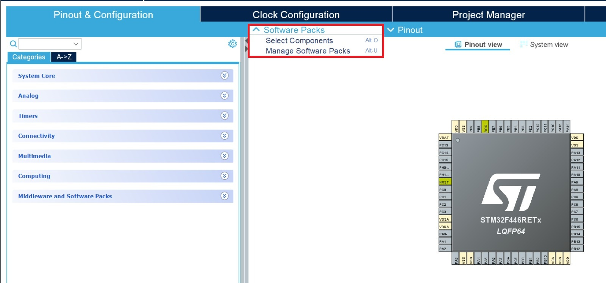

### Adım 2: Uygun Paketin İndirilmesi
Açılan listeden kartımız için uygun olan `STMicroelectronics.X-CUBE-AZRTOS-F4` paketini bulup yanındaki **Install** butonuna basıyoruz. Bu paketi seçme sebebimiz, doğrudan **STM32F4** serisinin çevre birimleri (timers, interrupts, DMA vb.) ve bellek mimarisi için optimize edilmiş olmasıdır. Ayrıca bu paketi kurduğunuzda projenizin konfigürasyonu (saat ayarları, pin yapılandırmaları ve kütüphane bağımlılıkları) otomatik olarak yönetilir ve olası çakışmalar önlenir.

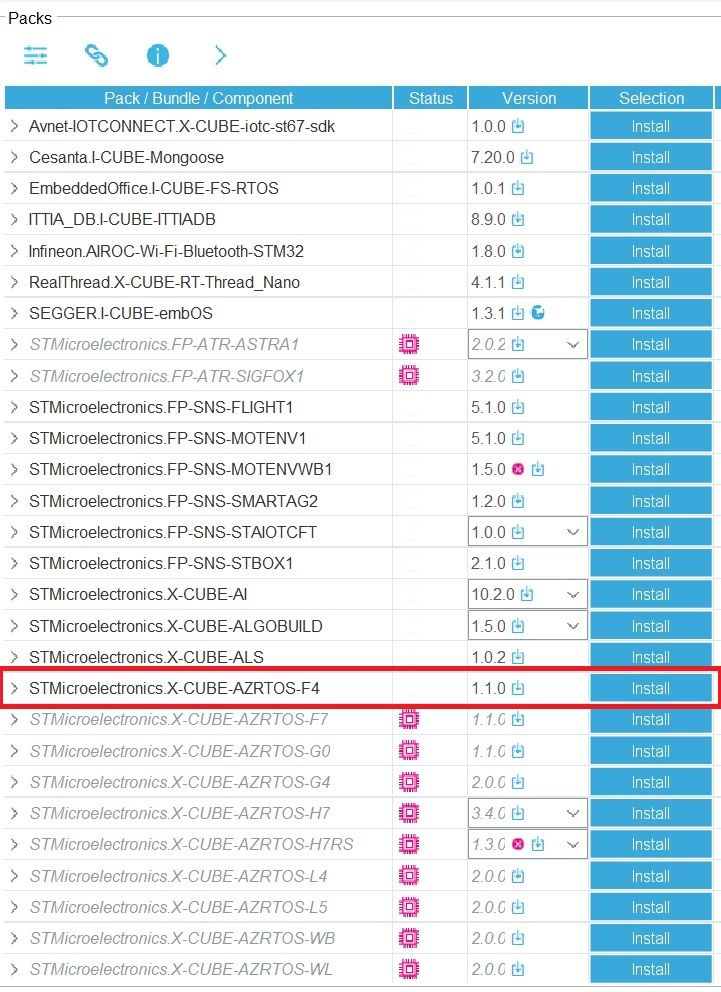

### Adım 3: ThreadX Core Aktivasyonu
İndirme bittikten sonra üst kısımdan `AZRTOS-F4` bölümünü genişletiyoruz. `RTOS ThreadX` altındaki `ThreadX` kısmını açıp **Core** seçeneğinin yanındaki kutucuğu işaretliyoruz. Bu işlem temel olarak **Azure RTOS**'u sisteme dahil eder.

Diğer seçeneklerin görevleri şöyledir:

* **PerformanceInfo:** Sistem performansını ve thread (görev) istatistiklerini izlemek için kullanılır.
* **TraceX support:** ThreadX'in olay izleme (event tracing) aracına veri sağlamak içindir. Sistemdeki geçişleri, kesmeleri ve thread değişimlerini adım adım loglayıp grafiksel olarak incelemenize yarar; ileri düzey hata ayıklama (debugging) yapmanızı sağlar.
* **Low Power support:** Mikrodenetleyicinin düşük güç modlarına (Sleep, Stop vb.) geçerken RTOS zamanlayıcısının ve tick'lerinin düzgün yönetilmesini sağlar. Projeniz pil tasarrufu odaklı değilse (örneğin sürekli çalışacak bir sistemse) aktif edilmez.

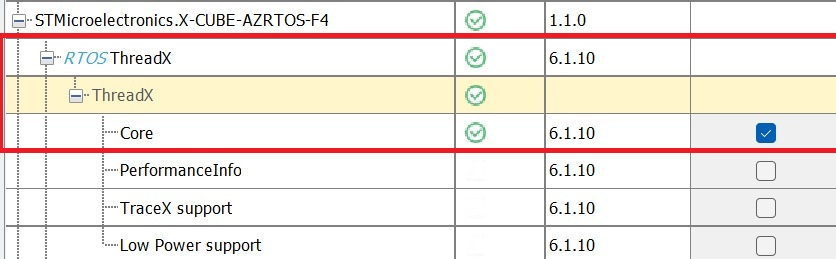

### Adım 4: Middleware Üzerinden Aktifleştirme
Sol menüdeki **Middleware and Software Packs** sekmesine geliyoruz. Buradan az önce indirdiğimiz `X-CUBE-AZRTOS-F4` seçeneğine tıklıyoruz.

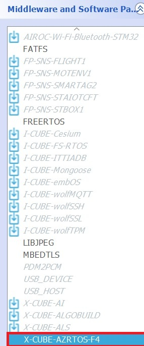

Açılan sağ ekranda **RTOS ThreadX** kutucuğunu işaretliyoruz. Bu işlemi yaptığınızda alt kısımda konfigürasyon ayarları (Memory Allocation vb.) görünür hale gelecektir.

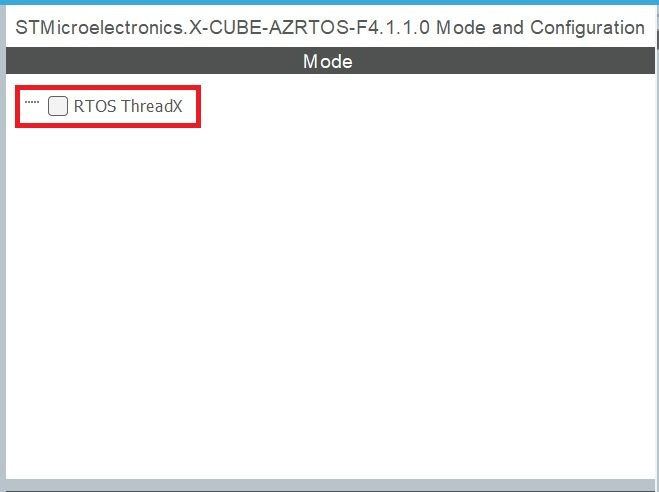
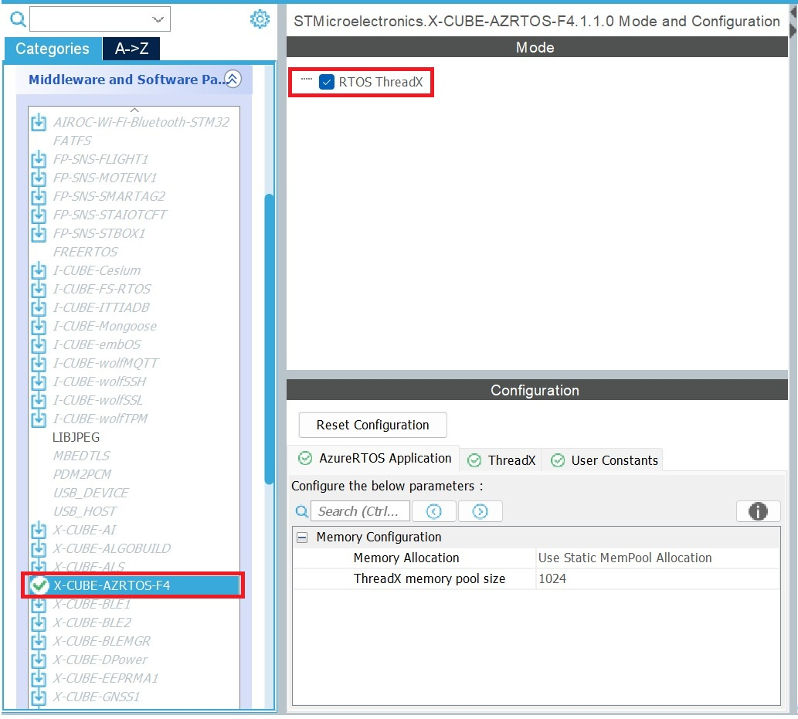

### Adım 5: Kod Üretimi ve SysTick Uyarısı
Tüm ayarları yaptıktan sonra projeyi kaydetmek ve kodları üretmik için `Ctrl + S` yapıyoruz. Sistem size RTOS kullanımıyla ilgili bir uyarı penceresi çıkaracaktır. Bu pencerede kod üretimine **Yes** diyerek devam ediyoruz.

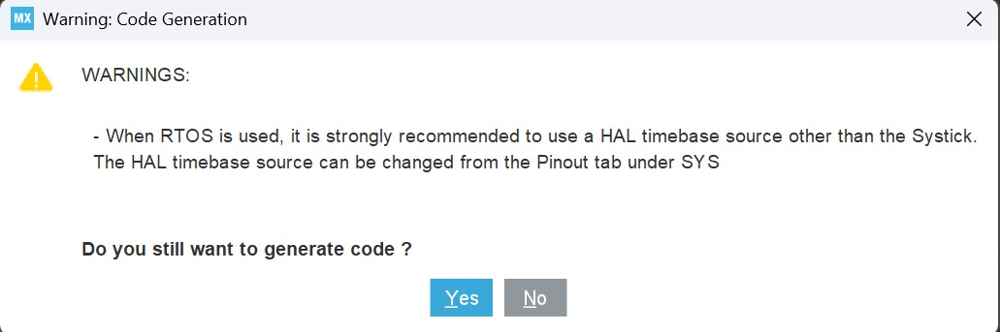

İşlem tamamlandığında, Azure RTOS dosyaları sisteminize entegre edilmiş olacaktır. Proje dizininde `AZURE_RTOS` klasörünün geldiğini görebilirsiniz.

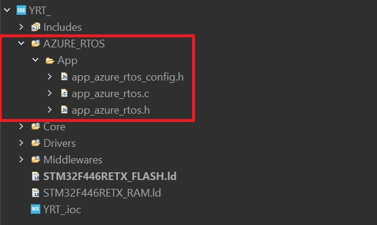

### Adım 6: Zaman Tabanı (Timebase Source) Ayarı
Azure RTOS aktif edildikten sonra, `tx_thread_sleep()` gibi zamanlama (clock) gerektiren komutları olduğu için ana **SysTick** sayacını Azure RTOS devralır.

HAL kütüphanesi de saatsiz kalamayacağı için ona yeni bir sayaç atamalıyız. `.ioc` dosyasını açıp sırasıyla **System Core > SYS** kısmına geliyoruz. **Timebase Source** açılır menüsünden boşta olan bir zamanlayıcıyı, örneğin **TIM6**'yı seçiyoruz.

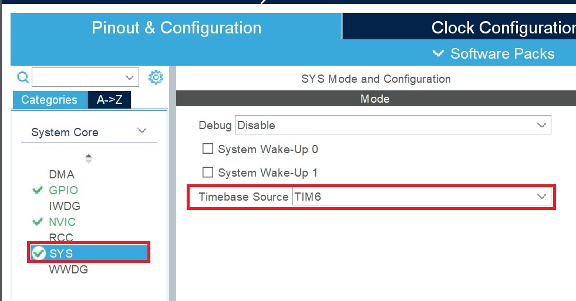

### Adım 7: Clock Configuration (Neden Sadece TIM6 Seçmek Yetmez?)

Zamanlayıcı olarak TIM6'yı atamak sadece görevi kime verdiğimizi belirler. Ancak sistemin varsayılan saat hızı (HCLK) başlangıçta genelde 16 MHz gibi düşük bir değerdedir. Üst sekmeden **Clock Configuration** ekranına geçtiğinizde bu durumu görebilirsiniz. 

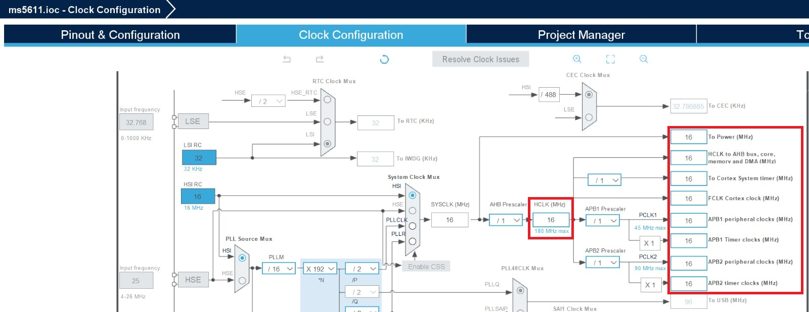

Yüksek hızlı veri işlediğimiz roket ve aviyonik sistemlerimizde bu 16 MHz'lik hız yetersiz kalır. TIM6'nın ve tüm sistemin tam performansta çalışması için saat hızını STM32F446RE kartımızın desteklediği maksimum hıza çıkarmalıyız.

* Ortada mavi yazıyla belirtilen HCLK (MHz) kutucuğunun altında, kartımızın maksimum hızı olan **180** yazar. Görevin gerekliliğine göre bu hız artırılabilir. Bu örnekte maksimum hız baz alınmıştır; değeri maksimum hıza alıp Enter'a basın.

* Bu değişikliği yaptığınızda, sistem eski ayarlarla 180 MHz'e ulaşamayacağını fark edecektir. Karşınıza *"No solution found using the current selected sources. Do you want to use other sources?"* şeklinde bir uyarı penceresi çıkacaktır. Bu pencereye **OK** diyerek otomatik hesaplama yapmasına izin verin.

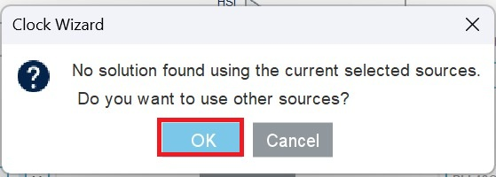

* Sistem gerekli tüm çarpan ve bölen (PLL) hesaplamalarını otomatik olarak yapacak ve ana hızı 180 MHz'e sabitleyecektir. Aynı zamanda TIM6'nın bağlı olduğu **APB1 Timer clocks** hattını da yeni yüksek hıza göre senkronize edecektir.

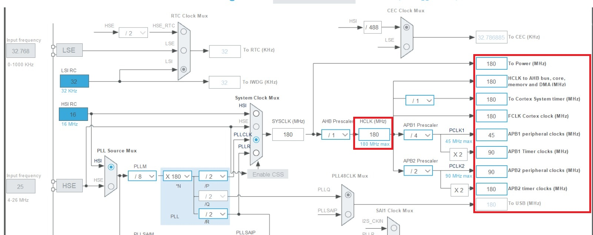

Bu son adımla birlikte sisteminiz maksimum hıza ulaşmış olur. Artık hem RTOS zamanlamalarımız şaşmayacak hem de işlemcimiz projelerimiz için gereken tam performansta çalışacaktır.

---

### Adım 8: İlk Görevi (Thread) Oluşturma ve Kodlama

STM32CubeIDE kod ürettikten sonra ThreadX yapılandırmaları `main.c` yerine otomatik üretilen `AZURE_RTOS/App/app_azure_rtos.c` dosyası içerisinde yönetilir. RTOS başlatıldığında sistem `tx_application_define()` fonksiyonunu çağırır ve bu süreç `App_Azure_RTOS_Init()` üzerinden ilk görevlerimizi (thread) sisteme tanıtmamızı sağlar.

**Örnek Thread Tanımlaması (`app_azure_rtos.c`):**

```c
#define THREAD_STACK_SIZE 1024

/* Thread Kontrol Bloğu ve Stack Tanımlamaları */
TX_THREAD status_led_thread;
UCHAR status_led_stack[THREAD_STACK_SIZE];

/* Görev Fonksiyon Prototipi */
VOID status_led_entry(ULONG thread_input);

UINT App_Azure_RTOS_Init(VOID *memory_ptr)
{
    UINT status = TX_SUCCESS;

    /* Thread Oluşturma */
    status = tx_thread_create(&status_led_thread,         /* 1. Thread Kontrol Bloğu */
                              "Status LED Thread",        /* 2. Thread Adı */
                              status_led_entry,           /* 3. Çalışacak Fonksiyon */
                              0,                          /* 4. Başlangıç Parametresi */
                              status_led_stack,           /* 5. Stack Alanı Adresi */
                              THREAD_STACK_SIZE,          /* 6. Stack Boyutu (Byte) */
                              10,                         /* 7. Çalışma Önceliği (Priority) */
                              10,                         /* 8. Kesilme Eşiği (Preemption-Threshold) */
                              TX_NO_TIME_SLICE,           /* 9. Zaman Dilimleme (Time Slice) */
                              TX_AUTO_START);             /* 10. Başlatma Durumu */

    return status;
}

/* Görev Döngüsü (Thread Entry) */
VOID status_led_entry(ULONG thread_input)
{
    while(1)
    {
        HAL_GPIO_TogglePin(GPIOA, GPIO_PIN_5); /* Durum LED'ini yak/söndür */
        tx_thread_sleep(100);                  /* 100 Tick Bekleme (CPU'yu serbest bırakır) */
    }
}

### Kod Bloklarının ve Parametrelerin Detaylı Açıklaması

**1. Bellek ve Değişken Tanımlamaları**

* **`TX_THREAD status_led_thread;`**: Thread'in çalışma durumunu, önceliğini ve dahili sayaçlarını tutan ThreadX kontrol yapısıdır.
* **`UCHAR status_led_stack[1024];`**: Görevin çalışırken kendi yerel değişkenlerini, adresleri saklayacağı ve fonksiyon çağrılarını yöneteceği 1024 byte'lık özel bellek (stack) alanıdır.
* **`VOID status_led_entry(ULONG thread_input);`**: Görevin ana kodunu barındıran fonksiyonun özel yeridir. ThreadX kuralı gereği bu fonksiyon geri dönüş değeri vermez (`VOID`) ve parametre olarak tek bir `ULONG` kabul eder.
* **`ULONG` (Unsigned Long)**: ThreadX ve gömülü C kütüphanelerinde 32-bit işaretsiz tamsayı veri tipini temsil eder

**2. `tx_thread_create` Parametre Dizilimi**

* **Control Block** (`&status_led_thread`): Oluşturulan thread'e erişim sağlayan yönetim nesnesinin bellek adresi.
* **Name** (`"Status LED Thread"`): TraceX gibi hata ayıklama (debug) araçlarında görevi ayırt etmeyi sağlayan metinsel isim.
* **Entry Function** (`status_led_entry`): Görev sırası geldiğinde işlemcinin çalıştıracağı ana fonksiyonun adı (pointer adresi).
* **Entry Input** (`0`): Görev fonksiyonu başlatılırken `thread_input` değişkenine aktarılan ilk veri. Başlangıç değeri gerekmiyorsa 0 yazılır.
* **Stack Start** (`status_led_stack`): Görev için ayrılan bellek (stack) dizisinin başlangıç adresi.
* **Stack Size** (`THREAD_STACK_SIZE`): Ayrılan bellek alanının byte cinsinden boyutu.
* **Priority** (`10`): Görevin öncelik seviyesi. ThreadX'te sayı küçüldükçe öncelik artar (0 en yüksek, 31 varsayılan en düşük seviyedir).
* **Preemption-Threshold** (`10`): Kesilme eşiği. Görev çalışırken kendisinden daha yüksek öncelikli görevlerin bu seviyeye kadar kendisini bölmesini engeller.
* **Time Slice** (`TX_NO_TIME_SLICE`): Aynı öncelikteki görevler arasında zaman paylaşımı süresi. `TX_NO_TIME_SLICE` verildiğinde görev işini bitirene veya uyku moduna geçene kadar CPU'yu bırakmaz.
* **Auto Start** (`TX_AUTO_START`): Sistemin açılışıyla görevin otomatik olarak çalışmaya başlamasını sağlar (`TX_DONT_START` verilirse manuel olarak `tx_thread_resume` ile başlatılması gerekir).
